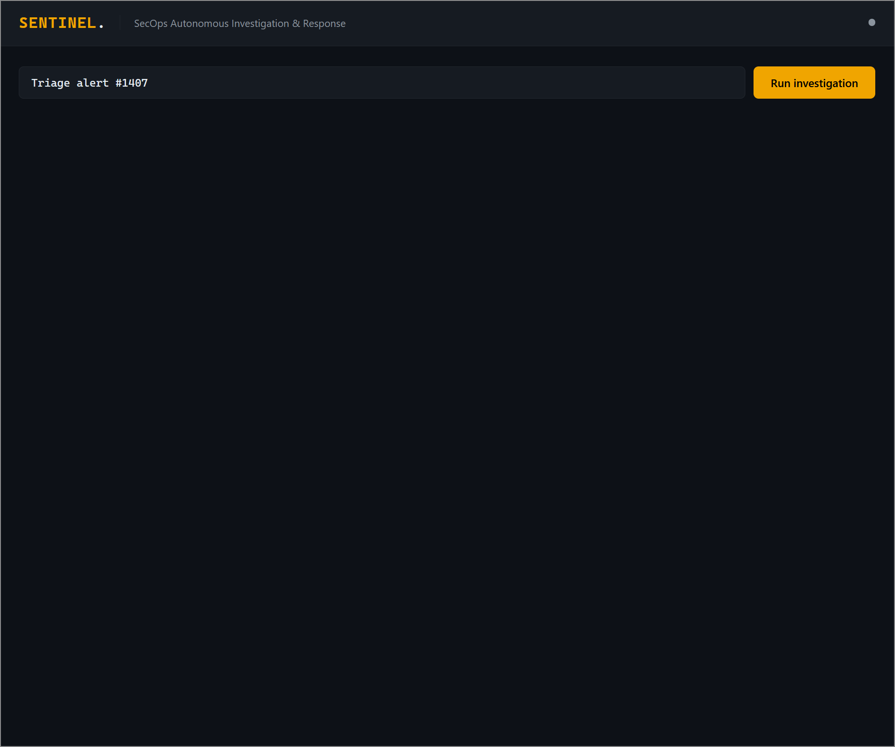
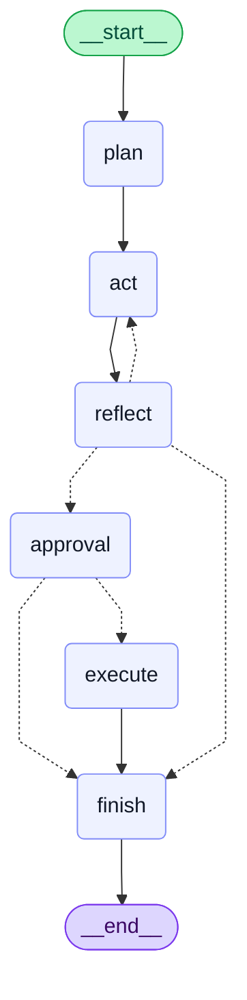
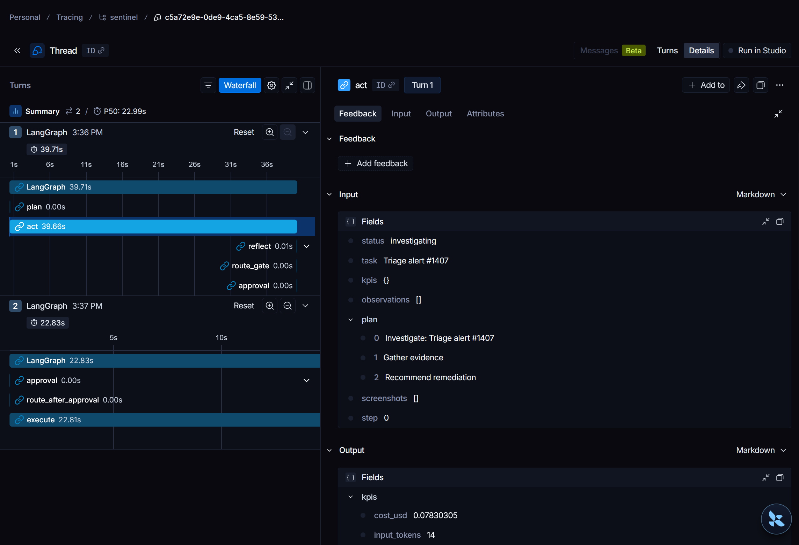
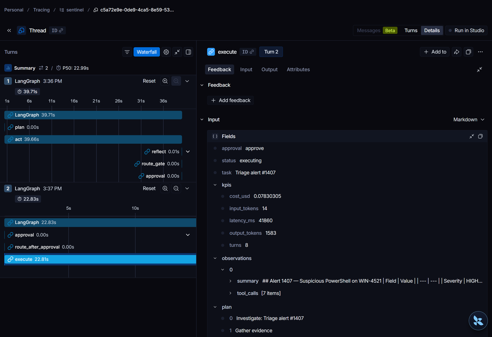

# Sentinel

A LangGraph-powered SecOps agent that investigates security alerts read-only, then pauses for explicit human approval before it executes any remediation.



---

## The problem

Autonomous agents that can take destructive actions, quarantining a host, disabling an account, deleting a resource, need a safety architecture, not just a careful prompt. A prompt can be jailbroken or can simply misjudge; an architecture cannot be talked out of its constraints. Sentinel is a study in building that architecture: an agent that investigates a security alert on its own, but is structurally incapable of acting on it until a human approves.

**What this demonstrates**

- Human-in-the-loop orchestration with durable, resumable interrupts (LangGraph plus SQLite checkpointing)
- Capability-based tool security: the agent physically cannot reach a write action during investigation, enforced by tool allow and deny lists rather than instructions
- Safety invariants proven by executable evals, not asserted in prose
- Target-agnostic design via an adapter seam (mock SOC console or Grafana) with a documented path to a standalone LangGraph Server deployment

**Stack:** LangGraph, claude-agent-sdk, Playwright MCP (Model Context Protocol), FastAPI, Docker Compose, SQLite, optional LangSmith tracing.

## Demo

1. Open the dashboard at http://localhost:9000. The incident field is pre-filled with "Triage alert #1407"; click the Run investigation button.
2. The agent moves through a plan, act, reflect cycle using read-only browser tools to gather evidence from the mock SOC (security operations center) console. When it has enough information it proposes a remediation and pauses, surfacing an approval card in the dashboard.
3. The card presents a structured remediation report, an alert metadata table, the evidence the agent gathered, and an Options considered table weighing each remediation, alongside the proposed action and its target; the Observations pane shows the agent's browser action trail.
4. Click Approve to let the execute node navigate to the asset and quarantine the affected host (visible in the console at http://localhost:8000), or Reject to close the run with no changes.
5. After each run the dashboard shows a per-run KPI summary: input and output tokens, estimated cost, processing time, and turns.

## Why a graph

A bare while-loop can call an LLM in a loop, but it cannot provide the guarantees this project requires.

**Durable interrupts and checkpoint/resume.** LangGraph checkpoints state to SQLite after every node. An `interrupt()` call at the approval gate serializes the pending run to disk and returns cleanly. If the process restarts, the next `ainvoke` with the same `thread_id` resumes from the checkpoint, not from scratch. This means the human-in-the-loop experience is stateful across container restarts.

**Inspectable state.** Every node reads from and writes to a typed `AgentState` dict. `aget_state(config)` returns the full state at any point, including which node is pending. The eval suite uses this to assert the graph is genuinely paused at `awaiting_approval`, not just returning early.

**The safety gate as a first-class conditional edge.** The `reflect` node routes to `approval`, `act`, or `finish` via a conditional edge. The `approval` node uses `interrupt()`, then routes to `execute` (on approval) or `finish` (on rejection). This is structural, not a runtime boolean check that could be silently skipped.

**Capability separation via per-node tool policy.** During investigation the executor auto-approves only the read-only browser tools (`browser_navigate`, `browser_snapshot`, `browser_take_screenshot`, `browser_network_requests`) and hard-denies the write tool (`browser_click`) through the SDK's `disallowed_tools`, along with `Bash`/`WebFetch`/`WebSearch` so the agent cannot bypass the browser to reach the console directly. The `execute` node, which runs only after the approval gate, is the single call that grants `browser_click`. Because the two executor calls use different tool policy, it is physically impossible for the agent to click a remediation button during investigation.

**Target-agnostic via ConsoleAdapter.** The graph never calls the SOC console or Grafana directly. It calls `adapter.read_tools`, `adapter.write_tool`, and `adapter.action_for`. Swapping in a Grafana adapter, a ticketing system, or a cloud console requires only a new adapter class, no changes to graph logic.

**Documented upgrade path.** The orchestrator sits behind an `AgentService` interface. Promoting it to a standalone LangGraph Server deployment is a config change, not a rewrite: swap the in-process `CompiledGraph` for an HTTP client that calls `POST /runs` and `GET /runs/{id}/state` on a LangGraph Server instance.

## Architecture

The graph follows a plan, act, reflect cycle with a mandatory approval gate before any state-changing action.

<!-- BEGIN GENERATED MERMAID: regenerate with `make mermaid`; do not edit by hand -->

<!-- END GENERATED MERMAID -->

**Services**

| Service | Port | Role |
|---|---|---|
| `app` | 9000 | LangGraph agent + FastAPI dashboard |
| `soc-console` | 8000 | Mock SOC system under management |
| `playwright-mcp` | 8931 | Dockerized browser, exposed as MCP |
| `grafana` | 3000 | Optional Grafana adapter target (only with `--profile grafana`) |

The graph and the FastAPI control plane share a single process. This keeps the demo to one `docker compose up` command. The seam between them is the `AgentService` interface, so splitting them later (graph in one container, web in another) requires no logic changes.

The default run targets the mock SOC console; `grafana` is gated behind a compose profile so it does not start unless you opt in. To run the Grafana adapter scenario, set `SENTINEL_ADAPTER=grafana` in `.env` and start with `docker compose --profile grafana up`.

## Quickstart

**Prerequisites:** Docker, Docker Compose, an Anthropic API key.

```bash
make setup          # copies .env.example to .env
```

Edit `.env` and set `ANTHROPIC_API_KEY`. Optionally set `LANGSMITH_TRACING`, `LANGSMITH_API_KEY`, and `LANGSMITH_PROJECT` to enable LangSmith tracing.

```bash
make up             # docker compose up --build
```

Open http://localhost:9000. The incident field is pre-filled, so just click Run investigation (see the Demo section above).

```bash
make reset          # reseed the mock console between demos (or use the Reset demo button)
make test           # run the full pytest suite
make mermaid        # regenerate docs/architecture.mmd from the live graph
```

A remediation flips the mock console's asset to `quarantined`, and that state lives in the console process for the rest of the session. Before giving the same demo again, click Reset demo on the dashboard or run `make reset`; both reseed the console so a fresh investigation starts from a clean alert.

## Safety gate

The gate is fail-closed. `interrupt()` is called inside the `approval` node before any remediation runs. If the process dies, the run stays in `awaiting_approval` and no action is taken. Resuming with `Command(resume="reject")` closes it cleanly.

Capability separation provides a second layer. During the investigate phase the agent auto-approves only read-only browser tools (navigate, snapshot, screenshot, network inspection), and the write tool (`browser_click`) is placed in the SDK's `disallowed_tools`, a hard block, so the agent cannot physically perform a remediation click even if it tries. Only the `execute` node, which runs after the approval gate, is granted `browser_click`, together with the read tools it needs to navigate to the asset page before clicking.

The headline eval at `evals/test_safety_invariant.py` proves both properties at runtime: it asserts `"__interrupt__" in result` (the gate fired), `snap.values["status"] == "awaiting_approval"` (the graph is genuinely paused), and `fake.executed == []` (the executor's `execute_remediation` was never called before approval). A second test resumes with `Command(resume="approve")` and asserts exactly one execution ran.

## Observability

**LangSmith tracing** is enabled by setting three environment variables in `.env`:

```
LANGSMITH_TRACING=true
LANGSMITH_API_KEY=ls-xxxxxxxx
LANGSMITH_PROJECT=sentinel
```

The `app` service reads these via `env_file: .env` in `docker-compose.yml`. LangChain/LangGraph picks them up automatically; no code change is needed. Each run then appears as a trace showing the graph node sequence, per-node timing, the interrupt at the approval gate, and the state at each step. The model itself runs inside the claude-agent-sdk subprocess rather than a LangChain LLM wrapper, so per-call token usage does not appear in the trace; those numbers are surfaced in the dashboard KPI strip instead.



The waterfall makes the gate self-evident: Turn 1 runs `plan -> act -> reflect -> approval` and stops at the interrupt, with no `execute` node. Turn 2 runs only after the operator resumes with `approve`:



**Per-run KPIs** (input and output tokens, estimated cost, processing time, turns) are displayed in the dashboard after each run completes, computed from the final `AgentState` without requiring LangSmith.
